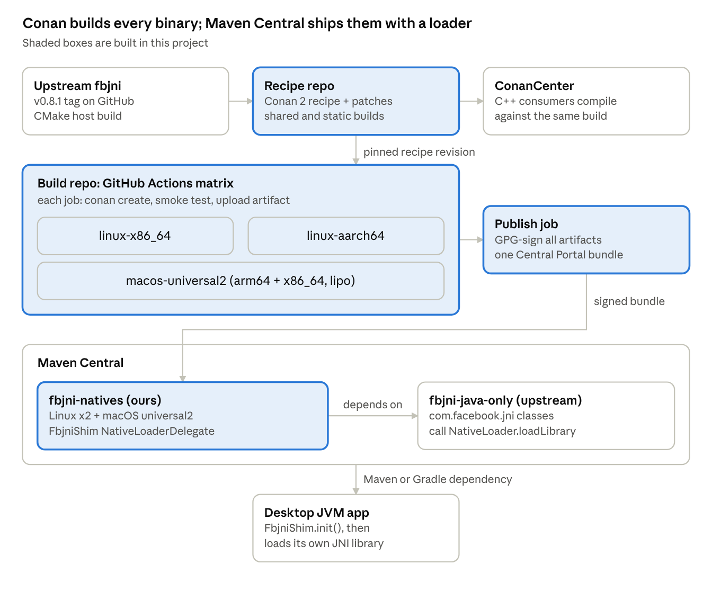

# fbjni Desktop Packaging — Design

Oct 1, 2026 · @Corey

## Summary

We will package Facebook's fbjni C++ JNI wrapper for desktop JVMs. A Conan 2 recipe will build it, and a separate repo's GitHub Actions matrix will build per-platform binaries and publish them to Maven Central. Today nobody publishes desktop fbjni binaries, but upstream already supports a host build, so this is packaging work, not a port.

**Goals**

- A Conan 2 recipe for fbjni (shared and static), suitable for ConanCenter.
- A single Maven Central jar carrying prebuilt `libfbjni` for Linux and macOS.
- A Java loader that extracts the right library and satisfies fbjni's `NativeLoader` with no setup by the app.
- One build path: the Maven binaries are produced by the Conan recipe, so compile-time and runtime binaries match.

**Non-goals**

- Windows in the first release (upstream does not support it).
- Republishing fbjni's Java classes; upstream already publishes them.
- Changes to fbjni itself, beyond small patches carried in the recipe.

## Background

Upstream fbjni (latest release v0.8.1, 25 Sep 2026) builds on desktop through CMake, but nobody ships the result. The findings below were checked against the upstream repo, ConanCenter and Maven Central on 1 Oct 2026.

| Area | Finding | Design consequence |
| --- | --- | --- |
| ConanCenter | No `recipes/fbjni` exists | No competing recipe; ours can be submitted |
| Upstream CMake | Desktop build supported; requires `-DJAVA_HOME=...` as a CMake variable | Recipe must locate a JDK and pass it |
| Upstream CMake | Tests fetch googletest at configure time | Recipe sets `FBJNI_SKIP_TESTS=ON` |
| Upstream CMake | Flags hardcoded: `-std=c++20 -pthread -O3 -DNDEBUG` | `build_type` is ignored; MSVC cannot build it |
| Upstream CMake | Windows explicitly unsupported (`win32/jni_md.h` defines `jint` as `long`) | Windows deferred |
| Upstream CMake | Has `install()` rules; JNI include dirs are PUBLIC absolute paths | Easy packaging; recipe decides how consumers find `jni.h` |
| Maven Central | `com.facebook.fbjni:fbjni-java-only` 0.8.1 (classes) and a `-headers.jar` | Depend on it; never republish its classes |
| Java side | `HybridData` and `ThreadScopeSupport` call `NativeLoader.loadLibrary("fbjni")` | Loader shim plugs in as a `NativeLoaderDelegate` |
| SoLoader `NativeLoader` | Throws `IllegalStateException` if not initialized; offers `initIfUninitialized` | Shim installs itself without clashing with an app's own loader |

## Architecture

Two repos feed two channels: the recipe repo (fbjni-conan) publishes to ConanCenter for C++ builds, and the build repo (fbjni-runtime-dist) publishes native binaries to Maven Central for runtime.



Because the CI matrix builds through the same recipe, the library an app compiles against and the one it loads at runtime come from one build definition.

## Conan 2 recipe

The recipe wraps upstream CMake with a few small patches and is the only way binaries get built. It lives in its own repo, structured for a later ConanCenter submission.

- **Options:** `shared` (default `True`) and `fPIC`, plus `system_java` (see Getting jni.h). Shared is the Maven path; static serves apps that bundle fbjni into one JNI library.
- **Validation:** raise `ConanInvalidConfiguration` on Windows and MSVC. Require C++17 (`check_min_cppstd(self, 17)`), not 20: upstream hardcodes `-std=c++20`, but a search of fbjni's sources found only C++17 features (`std::optional`, `[[maybe_unused]]`, `inline constexpr`). Requiring 20 would force every consumer into C++20. A test build with `-std=c++17` should confirm this.
- **Build:** pass `JAVA_HOME` and `FBJNI_SKIP_TESTS=ON`. Patch out the hardcoded `-O3 -DNDEBUG` so `build_type` works.
- **Linux SONAME:** keep the default `libfbjni.so` SONAME. The runtime loader relies on it (see Risks).
- **macOS install name:** set `@rpath/libfbjni.dylib`. Minimum macOS 11.0 (`CMAKE_OSX_DEPLOYMENT_TARGET` from settings), because arm64 Macs require 11.0.
- **package_info():** `set_property("cmake_target_name", "fbjni::fbjni")`; on Linux add `pthread` to `system_libs`. Ignore upstream's `fbjniLibraryConfig.cmake`; Conan's generators replace it.
- **License:** Apache-2.0; copy `LICENSE` into the package.

**ConanCenter's build matrix.** ConanCenter's official [Supported platforms and configurations](https://github.com/conan-io/conan-center-index/blob/master/docs/supported_platforms_and_configurations.md) doc is out of date. The table below therefore compares it with the binaries ConanCenter actually publishes, listed on 1 Oct 2026 with `conan list "<ref>:*" -r conancenter` (Conan 2.33.0) for fmt 12.0.0 and upa-url 2.5.0. All builds are Release.

| Source | Linux | macOS | Windows |
| --- | --- | --- | --- |
| Published binaries (current) | GCC 13, x86_64, `gnu17` | apple-clang 17, armv8 and x86_64, `gnu17` | MSVC 194 (VS 2022), x86_64 and armv8 |
| Official doc (stale) | GCC 11, x86_64 | apple-clang 13, armv8 only, minimum macOS 11.0 | MSVC 2019, x86_64 |

- **Built from source by users:** only Linux aarch64 lacks ConanCenter binaries; users get it with `--build=missing`. Our CI is its only regular test.
- **C++17 requirement is safe:** current builds default to `gnu17`. The pipeline also retries other standards when a recipe rejects the default: ConanCenter's [CI changelog](https://github.com/conan-io/conan-center-index/blob/master/docs/changelog.md) for 22 July 2022 says "Iterate `cppstd` values in profiles to build first match", and djinni-support-lib 1.2.1 binaries were built on apple-clang 13 with C++ standard `17`, for armv8 and x86_64.
- **Maven jar unaffected:** our CI builds every slice from the recipe itself, so the universal2 plan stands.
- **Windows:** ConanCenter builds x86_64 and armv8; the recipe rejects both with `ConanInvalidConfiguration`.
- **Minimum macOS 11.0** is our own choice, because arm64 Macs require it; we did not check what minimum current ConanCenter binaries target. Intel Macs before 11.0 are not supported.

**Getting `jni.h`.** fbjni's public headers include `jni.h`, so the recipe's build and its consumers both need JDK headers. Only headers are read; no JDK binary runs during the build.

- **Recipe JDK:** option `system_java`, default `False`, following ConanCenter's [djinni-support-lib](https://github.com/conan-io/conan-center-index/blob/master/recipes/djinni-support-lib/all/conanfile.py) recipe (a JNI library, migrated to Conan 2 in Nov 2023). By default the recipe takes `tool_requires("zulu-openjdk/...")`, so it builds with no JDK installed, including on ConanCenter. With `system_java=True` it reads the Conan conf `user.fbjni:java_home`, then the `JAVA_HOME` env var, and fails with a message naming both if neither is set. `package_id()` drops `system_java`, since the binary is identical either way.
- **Consumers** get `jni.h` from their own JDK through `find_package(JNI)` in the recipe's CMake integration.
- **CI on macOS:** the runner images ship several JDKs, each exposed as a `JAVA_HOME_<version>_<arch>` variable. The build passes `-o "fbjni/*:system_java=True"` and sets `JAVA_HOME` from the variable for our pinned major version, so nothing is downloaded and no `setup-java` step is needed.
- **CI on Linux:** builds run as a job-level `container:` in the org's existing [engine-build](https://github.com/measly-java-learning/base-docker-images) image (`ghcr.io/measly-java-learning/engine-build`). It is multi-arch (amd64 and arm64), built on a pinned manylinux_2_28 with gcc-toolset-14, and bakes in a Corretto 8 JDK with `JAVA_HOME=/opt/corretto-jdk`; its build verifies `include/jni.h` and `include/linux/jni_md.h`. Builds pass `system_java=True`, so nothing is downloaded.

```yaml
jobs:
  linux:
    strategy:
      matrix:
        runner: [ubuntu-latest, ubuntu-24.04-arm]
    runs-on: ${{ matrix.runner }}
    container:
      # pin by index digest, per base-docker-images' README
      image: ghcr.io/measly-java-learning/engine-build@sha256:<index digest>
    steps:
      - uses: actions/checkout@v5
      - run: conan create . -o "fbjni/*:system_java=True"
```

JDK 8's headers are enough: fbjni needs only the JNI headers, which have been stable for years. This replaces the earlier plan of mounting the runner's JDK into a plain manylinux container, and keeps fbjni on the same toolchain as the org's other runtime builds.

## Build and publish pipeline

A matrix of build jobs runs the Conan recipe per platform. A single final job assembles, signs and publishes everything as one Maven Central release.

| Target | Runner | Notes |
| --- | --- | --- |
| linux-x86_64 | `ubuntu-latest` in the engine-build image | Old glibc baseline for broad distro support |
| linux-aarch64 | `ubuntu-24.04-arm` in the engine-build image | Native Arm runner, no emulation |
| macos-universal2 | `macos-latest` | Builds arm64 natively and cross-compiles x86_64 (one Conan build per arch), then lipo -create merges them. Test the x86_64 slice under Rosetta if the runner image has it. Minimum macOS 11.0 (required for arm64) |

Each build job:

1. Runs `conan create` with the recipe at a pinned revision.
2. Runs a smoke test: a JVM loads the library through the shim and creates a `HybridData` object.
3. Uploads the library as a workflow artifact.

The publish job:

1. Downloads all platform artifacts and fails if any is missing.
2. Builds one jar holding the shim and all three libraries (Linux x86_64, Linux aarch64, macOS universal2) under per-platform resource paths (e.g. /fbjni-natives/linux-x86_64/libfbjni.so), plus the sources jar, javadoc jar and POM.
3. Signs everything with GPG and uploads one bundle to the Central Portal. Since OSSRH shut down in 2025, the Portal takes one bundle per release, so per-job publishing does not work.

**Versioning.** The artifact version tracks upstream (`0.8.1`). Central releases can never be changed, so a packaging-only fix gets a fourth number (`0.8.1.1`).

**Coordinates.** Artifacts publish as `org.measly:fbjni-natives`, under the `org.measly` namespace that the [measly-java-learning](https://github.com/measly-java-learning/) GitHub org can already publish to. Both repos, fbjni-conan and fbjni-runtime-dist, live in that org; the second follows the org's \*-runtime-dist naming. We cannot use the `com.facebook` groupId.

**Publishing limits.** Since 1 Oct 2026, Maven Central caps each organization's monthly file count, release size and release count, summed across all its namespaces. The free-tier figures Sonatype cites are 1,167 files, 78 MB and 7 releases per month; the Usage Center shows the binding numbers. Exceeding one starts a 30-day grace period, after which new releases are rejected until the month resets. Open-source projects can request higher limits.

- **Size:** strip all three libraries; debug symbols would multiply the release size.
- **Files:** publish only the required `.asc`, `.md5` and `.sha1` beside each file. Gradle's `maven-publish` adds SHA-256 and SHA-512 by default, so turn those off.
- **Releases:** each packaging fix (`0.8.1.1`) spends one of 7 per month, so validate the bundle in the Portal before publishing.

**One jar, not classifiers.** All platforms ship in one jar. Per-platform classifier jars forced strict classifier setup on consumers behind an Artifactory proxy in past work, while a single jar needs plain coordinates in Maven, Gradle and proxies. The stripped libraries total a few MB, so the extra download is small. Classifier jars can be added later beside the single jar if someone needs slim per-platform bundles.

## Java loader shim

The shim is a `NativeLoaderDelegate`. It answers fbjni's `NativeLoader.loadLibrary("fbjni")` by extracting the bundled library to a persistent per-user cache and calling `System.load(absolutePath)`. fbjni has no setting for where its library comes from, so these choices belong to the shim.

**Installation.** The shim calls `NativeLoader.initIfUninitialized(new FbjniShimDelegate())` from a static initializer in its entry class. An app that already installed its own delegate keeps it. Apps call `FbjniShim.init()` once before touching fbjni classes. A `ServiceLoader` auto-init hook is left out of v1 and considered later if users ask for it.

**Library location, in priority order:**

1. `-Dfbjni.shim.library=/abs/path/libfbjni.so`: load that file, no extraction. For distro packaging, jlink images and GraalVM native-image.
2. `-Dfbjni.shim.system=true`: call `System.loadLibrary("fbjni")` and rely on `java.library.path`.
3. `-Dfbjni.shim.static=true`: do nothing, because the app linked fbjni statically into its own JNI library.
4. `-Dfbjni.shim.cachedir=...` system property.
5. `FBJNI_SHIM_CACHE_DIR` environment variable.
6. Platform cache directory: `$XDG_CACHE_HOME/fbjni-shim` (default `~/.cache/fbjni-shim`) on Linux, `~/Library/Caches/fbjni-shim` on macOS.
7. `java.io.tmpdir`, when the home directory is missing or not writable (containers with `HOME=/`, read-only root filesystems, serverless runtimes).

The system property beats the env var so an embedding app can set it in code, while ops can still use the env var in containers.

**Why a persistent cache instead of a fresh temp dir:** extraction happens once per version, `noexec /tmp` mounts are avoided, `systemd-tmpfiles` cannot delete the file under a running process, and other users cannot plant files in our path. JavaCPP uses the same pattern (`~/.javacpp/cache`).

**Cache layout and writes:**

- Path: `<cache>/<version>/<os>-<arch>/<sha256-prefix>/libfbjni.so`. Content-addressed, so a path never holds two different files.
- Write to a temp file in the same directory, then atomically rename into place. Racing JVMs write identical bytes, so no lock is needed.
- Never overwrite or truncate an existing library. Doing so to a file another process has mapped can crash it.
- Verify the SHA-256 of an existing file before reuse; a mismatch means a partial write, so re-extract alongside.
- In a shared temp dir, create a per-user subdirectory with mode 0700 and check ownership before using it.

**Platform detection** maps `os.name` and `os.arch` to a resource path and fails with a clear message naming the unsupported platform and the override properties. On macOS only `os.name` matters, because the universal2 dylib covers both architectures, including an x86_64 JVM under Rosetta.

**Static linking without our jar.** Apps that link fbjni statically into their own JNI library do not need `fbjni-natives`. They install a delegate that treats `"fbjni"` as already loaded, which takes a few lines against SoLoader's `NativeLoaderDelegate` interface. We document this snippet instead of publishing a separate shim artifact.

```java
NativeLoader.initIfUninitialized(new NativeLoaderDelegate() {
  @Override
  public boolean loadLibrary(String shortName, int flags) {
    if (!shortName.equals("fbjni")) {   // fbjni is linked into our JNI library
      System.loadLibrary(shortName);
    }
    return true;
  }

  @Override
  public String getLibraryPath(String libName) {
    return null;
  }

  @Override
  public int getSoSourcesVersion() {
    return 0;
  }
});
```

## Risks

The biggest risk is C++ ABI mismatch between our binary and the consumer's own JNI code; the others are manageable with tests.

| Risk | Why it matters | Mitigation |
| --- | --- | --- |
| C++ ABI mismatch | fbjni is header-heavy C++; `std::string`, exceptions and `HybridClass` vtables cross between the consumer's library and `libfbjni` | Link libstdc++ dynamically, never statically. Build on manylinux_2_28. Document the minimum libstdc++ and `_GLIBCXX_USE_CXX11_ABI=1` |
| Load order of consumer libraries | A consumer's `libfoo.so` lists `libfbjni.so` as a dependency, but ours sits in the cache dir, not on the search path | Load fbjni first. Linux reuses an already-loaded library with a matching SONAME. macOS: rely on the `@rpath` install name and prove it in CI |
| Static and shared copies mixed | Two copies of fbjni in one process each register natives for `HybridData`; the last one wins | Document one model per process. The `static` shim mode stops the shared copy from loading |
| Delegate already installed | An app using SoLoader may have its own delegate, so ours never runs | `initIfUninitialized`; document that such apps must load `libfbjni` themselves |
| Upstream build drift | Recipe patches may break on new fbjni releases | Pin the upstream tag per recipe version; CI builds each new upstream release |
| Maven Central publishing limits | Monthly caps per organization on files, size and releases (free tier cited at 1,167 files, 78 MB, 7 releases); the budget is shared with every other org.measly project | Strip binaries, skip optional checksums, validate before publishing, and request an open-source exemption if the budget gets tight |
| Windows demand | Users will ask for it | Out of scope for v1; needs an upstream fix for `jint` on Windows |

## Scope and open questions

Version 1 ships Linux (x86_64, aarch64) and macOS (arm64 and x86_64 in one universal2 dylib) for fbjni 0.8.1, in three phases.

1. **Recipe.** Conan 2 recipe with shared and static builds, tested locally on Linux and macOS.
2. **Shim and pipeline.** Loader shim, the CI matrix with smoke tests, and a snapshot publish to a staging repository.
3. **Release.** First Central release; then submit the recipe to ConanCenter.

**Open questions**

- [x] One jar with every platform, or a jar per platform with classifiers (`natives-linux-x86_64`, LWJGL style)? Per-platform jars keep downloads small but make Gradle and Maven setup harder. Decided: one jar with all platforms (see Build and publish pipeline).
- [x] Separate arm64 and x86_64 macOS libraries, or one universal2 dylib? Decided: universal2, merged with lipo in CI; the recipe stays one arch per build.
- [x] Should the shim ship in its own small artifact, so apps that link fbjni statically can use it without the native jar? Decided: no for v1; static users install their own small delegate (snippet in Java loader shim). A separate artifact can be split out later without breaking anyone.
- [x] Is a `ServiceLoader` auto-init hook worth it, or is an explicit `FbjniShim.init()` call clearer? Decided: explicit `init()` for v1; revisit `ServiceLoader` if there is demand.
- [x] Which Maven namespace and GitHub org will own the artifacts? Decided: `org.measly` on Maven Central, repos in the measly-java-learning GitHub org.
- [x] Will ConanCenter accept a recipe that needs a preinstalled JDK, or must that submission add a `tool_requires`? Decided by precedent: default to a `zulu-openjdk` `tool_requires` with a `system_java` opt-out, as djinni-support-lib does.
- [ ] Follow-up: find a more recent ConanCenter recipe that uses a JDK `tool_requires`, to confirm the djinni-support-lib precedent still reflects current review policy.
- [ ] Follow-up: create docs issue for ConanCenter regarding outdated platforms doc.
- [x] Conan's default C++ standard for apple-clang 13 may be older than 17. If so, how does ConanCenter's pipeline handle a recipe that requires 17 on its default macOS profile? Decided: not a problem. The pipeline iterates C++ standards to the first that builds (changelog, 22 July 2022), djinni-support-lib 1.2.1 has apple-clang 13 binaries at `17`, and current builds default to `gnu17` anyway.

## References

- [facebookincubator/fbjni](https://github.com/facebookincubator/fbjni): upstream repo
- [fbjni CMakeLists.txt](https://github.com/facebookincubator/fbjni/blob/main/CMakeLists.txt): host build, flags, Windows note, install rules
- [fbjni HybridData.java](https://github.com/facebookincubator/fbjni/blob/main/java/com/facebook/jni/HybridData.java): `NativeLoader.loadLibrary("fbjni")` call
- [SoLoader NativeLoader.java](https://github.com/facebook/SoLoader/blob/main/java/com/facebook/soloader/nativeloader/NativeLoader.java): delegate API and `initIfUninitialized`
- [fbjni-java-only on Maven Central](https://repo1.maven.org/maven2/com/facebook/fbjni/fbjni-java-only/): existing Java artifact
- [conan-io/conan-center-index](https://github.com/conan-io/conan-center-index): no fbjni recipe as of 1 Oct 2026
- [ConanCenter supported platforms and configurations](https://github.com/conan-io/conan-center-index/blob/master/docs/supported_platforms_and_configurations.md): official build matrix, out of date as of 1 Oct 2026
- [djinni-support-lib recipe](https://github.com/conan-io/conan-center-index/blob/master/recipes/djinni-support-lib/all/conanfile.py): ConanCenter precedent for a JDK `tool_requires` with a `system_java` opt-out
- [ConanCenter CI changelog](https://github.com/conan-io/conan-center-index/blob/master/docs/changelog.md): 22 July 2022 entry on iterating `cppstd` values
